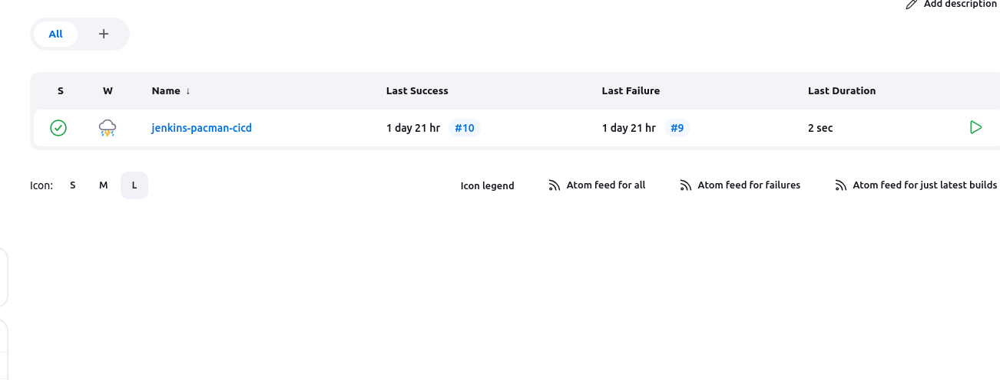

# Jenkins

Jenkins is an open-source server that is written entirely in Java. It  you execute a series of actions to the achieve continuous integration process, that too in an automated fashion.

Required is: Java SDK/JDK

Basic Port for Jenkins: 8080

For connection b/w Jenkins and GitHub : SSH Key is provided. 
